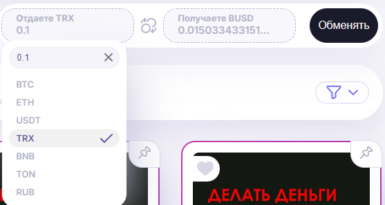
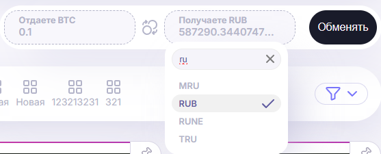

# Журнал обновлений

## Обновление от 25.09.2024

- добавлены инпуты на поиск и ввод количества валюты в обменнике
- добавлен список валют с которых конвертировать
- добавлена ссылка на обменник
- добавлен лоадер!

## Обновление от 24.09.2024

- добавлен обменник с внешней ссылкой на сам обменник и выбором в какую валюту обменивать
`реализовано пока только отображение курса из BTC в любую другую валюту`
- добавлен новый тип попапов - внешняя ссылка 
`при переходе на внешнюю ссылку нужно будет подтвердить переход`
- фиксы в компонентах: сортировка, попап 
`теперь кнопка может быть как и <button> так и <a>`
- внесен фикс вызывающий баг на авторизации
`приходил null при определенных действиях`
- добавлен скроллбар в новом стиле
- вернул sign out